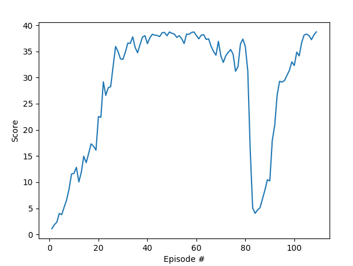

# Reacher Project (Continuous Control): 

Continuous Control project by Udacity for the Deep Reinforcement Learning Nanodegree

## Introduction

For this project, we will be working with the [Reacher](https://github.com/Unity-Technologies/ml-agents/blob/master/docs/Learning-Environment-Examples.md#reacher) environment.


In this environment, a double-jointed arm can move to target locations. A reward of +0.1 is provided for each step that the agent's hand is in the goal location. Thus, the goal of your agent is to maintain its position at the target location for as many time steps as possible.

The observation space consists of 33 variables corresponding to position, rotation, velocity, and angular velocities of the arm. Each action is a vector with four numbers, corresponding to torque applicable to two joints. Every entry in the action vector should be a number between -1 and 1.

## Project Version treated

For this project, two separate versions of the Unity environment are provided:

- The first version contains a single agent.
- The second version contains 20 identical agents, each with its own copy of the environment.

The version treated with this solution is the second version (20 identical agents, each with it's own copy of the environment).

## Solving criterias 

The barrier for solving the second version of the environment is slightly different, to take into account the presence of many agents. In particular, the agents must get an average score of +30 (over 100 consecutive episodes, and over all agents). Specifically,
- After each episode, we add up the rewards that each agent received (without discounting), to get a score for each agent.  This yields 20 (potentially different) scores.  We then take the average of these 20 scores. 
- This yields an **average score** for each episode (where the average is over all 20 agents).

The environment is considered solved, when the average (over 100 episodes) of those average scores is at least +30. 

## Agent Implementation (Learning Algorithm)
The learning algorithm used is the actor-critic method **Deep Deterministic Policy Gradient (DDPG)**.

The DDPG algorithm uses two agents, an actor and a critic. Each one has two networks: a local-network and a target-network. Thus, the Q-targets method is applied for both agents with soft-update of the targets. 

This algorithm is set to run 700 episodes, for each episode it iterates until the environment is done. 
The main operations performed with each episode are: 
- Initializing the environment.
- Getting initial states. 
- Navigating the environment until it's done:
	- passing current states to actor
	- performing actions
	- getting rewards, next-states, and dones
	- training all the agents 
	- break if environment done, loop otherwise
- saving the "average reward over all agents" and update the max average reward.
- after reaching 100 episodes, if average score is greater than 30 then environment is considered solved. 


### Architecture 

As previously mentioned, the state space has 33 dimensions which is the input of both our Deep Neural Networks (Actor and Critic). Since we're not dealing with images, the only type of layers used is Fully Connected layers. Thus, the architecture of the network and the chosen number of layers/neurons is described as follows: 

- **Actor Neural Network architecture:** 
Input layer: with 33 units (state_size=33) 
Two fully connected Hidden layers: with 128 units, 256 units respectively 
Output layer: with 4 units (action_size=4) 

Furthermore, Batch normalization is used before relu activation of the first layer, and tanh activation is used with the last layer to ensure actions are in range [-1, 1].

Thus, the forward mapping is: 
Input layer (33 units) -> Fully Connected Layer (128 units, Batch Normalization, Relu activation) -> Fully Connected Layer (256 units, Relu activation) -> Output layer (4 units, tanh activation) 

- **Critic Neural Network architecture:** 
Input layer: with 33 units (state_size=33) 
Two fully connected Hidden layers: with 128+4=132 units, 256 units respectively 
Output layer: with 1 units

Furthermore, Batch normalization is used before relu activation of the first layer, and result of the first layer is concatenated with the action. 

Thus, the forward mapping is: 
Input layer (33 units) -> Fully Connected Layer (128 units, Batch Normalization, Relu activation) + concatenate result with action (128+action_size) -> Fully Connected Layer (256 units, Relu activation) -> Output layer (1 unit) 


### Hyperparameters 

The hyperparameters used in our DDPG implementation are:

- Maximum number of episodes: 2000 
- Starting value of epsilon (for epsilon-greedy action selection): 1.0
- Minimum value of epsilon: 0.01
- Epsilion decay rate (multiplicative factor for decreasing epsilon): 0.995
- BUFFER_SIZE = 1e6 	  # replay buffer size
- BATCH_SIZE = 512  	  # minibatch size 
- GAMMA = 0.99            # discount factor 
- TAU = 1e-3  	          # for soft update of target parameters
- LR_ACTOR = 2e-4         # learning rate of the actor 
- LR_CRITIC = 2e-4        # learning rate of the critic
- WEIGHT_DECAY = 0        # L2 weight decay
- Optimizer: Adam


## Results
The results presented bellow meet the project's expectation, as our agents are able to get an average reward of at least +30 over 100 episodes. This performance is reached within less than 109 episodes only.

```
Episode 100	Average Score: 27.40

Average Score of 30.21 reached. Environment solved in 109 episodes.

```

### Plot of Rewards




## Ideas for Future Work
In this project, the training updates for both the actor and critic are performed after each iteration. A more suitable approach to consider is to delay the training, thus updating both networks 10 times after every 20 timesteps. 

It might also be better to implement more suitable methods for this problem like Trust Region Policy Optimization (TRPO) and Truncated Natural Policy Gradient (TNPG) which should achieve better performance. Or even the recent adaptation of DDPG for continuous control known as **Distributed Distributional Deterministic Policy Gradients (D4PG)**


